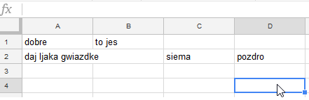
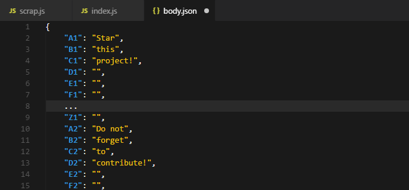

# Google spreadsheet to JSON

Simple script written in NodeJs that allows you to parse google spreadsheet to JSON.

*Sample google spreadsheet*



*Sample output*



## Getting Started

`yarn install`

`node index.js *remember to replace sheetId with your own sheetId*`

```
!important! allow to access your sheet by link
```

## Authors

* **Szymon Grącki** - [sgracki](https://github.com/sgracki)

See also the list of [contributors](https://github.com/your/project/contributors) who participated in this project.

## License

This project is licensed under the MIT License